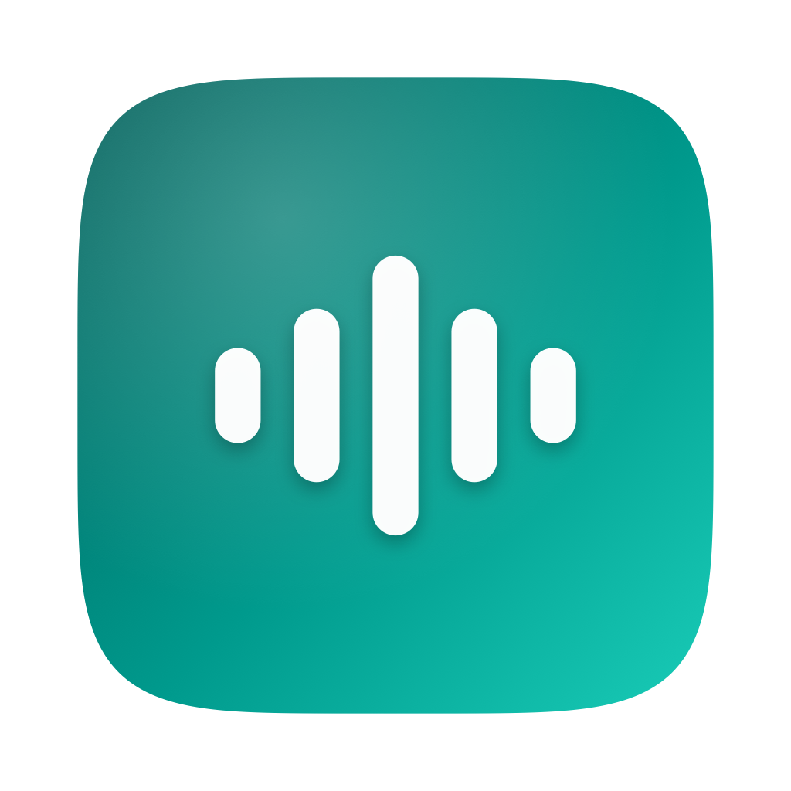

<p align="center">
  
</p>

<h1 align="center">Aloud</h1>

<p align="center">
  Select text anywhere on macOS, press a hotkey, hear it read aloud.<br>
  Runs entirely on-device — no cloud, no accounts, no Python.
</p>

<p align="center">
  
</p>

## What it does

1. Select text in any app — a browser, Mail, Notes, a PDF, Slack, wherever.
2. Press your hotkey (`⌃⌥Space` by default, customizable).
3. Aloud reads it back in a natural voice, streamed from [Kokoro](https://huggingface.co/hexgrad/Kokoro-82M) running locally via [MLX](https://github.com/ml-explore/mlx-swift) — Apple's on-device ML framework. No text ever leaves your Mac.

There's no dock icon, no main window — just a menu bar icon that pulses while it's working, and a small popover for playback controls, voice picking, and settings.

## Requirements

- macOS 15 (Sequoia) or later
- Apple Silicon (M1 or newer) — MLX requires it

## Install

1. Download the latest `Aloud.dmg` from [Releases](../../releases/latest).
2. Open the DMG and drag **Aloud** into **Applications**.
3. **First launch:** Aloud isn't notarized by Apple (no paid developer account behind this), so Gatekeeper will block it the first time. Right-click (or Control-click) `Aloud.app` in Applications and choose **Open**, then confirm **Open** in the dialog that appears. You only need to do this once.
4. Aloud walks you through the rest on first launch: granting Accessibility access (needed to read your text selection from other apps) and downloading the voice model (~340MB, one-time).

If step 3 doesn't work or you'd rather use the terminal:

```sh
xattr -dr com.apple.quarantine /Applications/Aloud.app
```

## Using it

Click the menu bar icon to open the popover — it shows the current voice, playback controls, and a caption of what's being read. Click the gear icon for Settings: pick a default voice (28 available, US/UK, male/female), change the hotkey, adjust reading speed, or turn on launch-at-login.

The icon itself doubles as a status indicator — it flips to an animated waveform the instant you press the hotkey (before capture or synthesis even finishes), so you always know a press registered.

## How it works

- **Text capture** — reads the current selection via the Accessibility API; falls back to a simulated ⌘C if the frontmost app doesn't expose selection through AX (some Electron/web apps don't).
- **Synthesis** — [`mlalma/kokoro-ios`](https://github.com/mlalma/kokoro-ios), a from-scratch MLX Swift port of Kokoro-82M. Long selections are chunked into sentence-sized pieces and streamed to playback as they synthesize, rather than waiting for the whole thing.
- **Playback** — `AVAudioEngine`, scheduled buffer-by-buffer.

Full design rationale and architecture notes are in [`SPEC.md`](SPEC.md).

## Privacy

Nothing about what you select or hear ever leaves your Mac. The only network traffic Aloud ever makes is the one-time voice model download on first launch, from a pinned, checksum-verified GitHub release.

## Building from source

```sh
brew install xcodegen
git clone https://github.com/tilakp/aloud.git
cd aloud
xcodegen generate
open Aloud.xcodeproj
```

Build and run from Xcode (⌘R). Swift Package Manager will resolve Kokoro, MLX, and the other dependencies on first build — this can take a few minutes.

## Credits

- [Kokoro-82M](https://huggingface.co/hexgrad/Kokoro-82M) — the TTS model itself (Apache 2.0)
- [mlalma/kokoro-ios](https://github.com/mlalma/kokoro-ios) — MLX Swift port used here (MIT)
- [ml-explore/mlx-swift](https://github.com/ml-explore/mlx-swift) — Apple's on-device ML framework
- [sindresorhus/KeyboardShortcuts](https://github.com/sindresorhus/KeyboardShortcuts) — global hotkey recording (MIT)

## License

[MIT](LICENSE)
