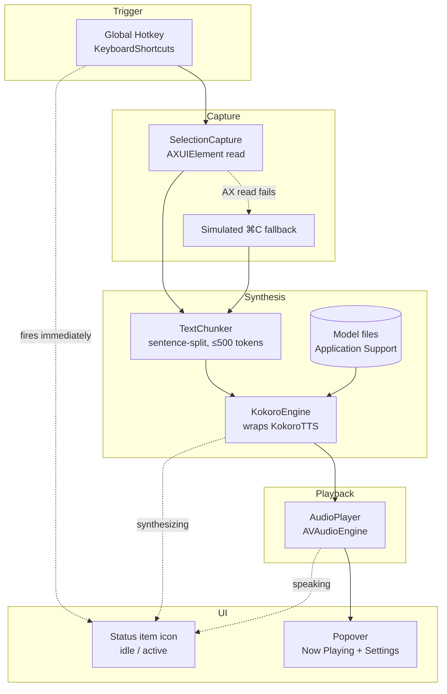

# Aloud — Implementation Spec

Select text anywhere on macOS, press a hotkey, hear it read aloud in a natural
voice. Local-only, no cloud calls, no Python.

## 1. Core user flow

1. User selects text in any app (Safari, Mail, Notes, Slack, a PDF, …).
2. User presses a global hotkey (default `⌃⌥Space`, user-customizable).
3. Aloud reads the current text selection via the macOS Accessibility API,
   chunks it into sentence-sized pieces, and starts synthesizing + playing
   audio within roughly a second.
4. The menu bar icon itself changes the instant the hotkey fires — before
   any audio starts — so it's always obvious whether Aloud is idle or doing
   something.
5. A small popover shows play/pause/stop, the voice in use, and (optionally)
   the sentence currently being spoken. Voice selection and settings live in
   that same popover — there is no separate main window.

## 2. Tech stack

| Concern | Choice |
|---|---|
| UI | SwiftUI (macOS 15+), AppKit `NSStatusItem` for the menu bar item |
| TTS engine | [`mlalma/kokoro-ios`](https://github.com/mlalma/kokoro-ios) — Kokoro-82M ported to **MLX Swift**, runs fully on-device, no Python/espeak. Apache-licensed model, MIT-licensed Swift port. |
| G2P (text→phonemes) | Bundled `MisakiSwift`, shipped inside the package — no separate install |
| ML runtime | Apple MLX (GPU via Metal) |
| Global hotkey | [`sindresorhus/KeyboardShortcuts`](https://github.com/sindresorhus/KeyboardShortcuts) — MIT, 2.7k★, actively maintained, gives us the recorder UI for free |
| Text selection capture | Accessibility API (`AXUIElement`), with simulated-copy as a silent fallback (see §5.2) |
| Audio playback | `AVAudioEngine` + `AVAudioPlayerNode`, streaming buffers per chunk |
| Model distribution | Downloaded on first launch to `~/Library/Application Support/Aloud/Models/`, not bundled in the app binary |

**Platform floor:** macOS 15.0+, Apple Silicon only (MLX requirement) — confirmed
acceptable. This machine (macOS 26.6, arm64) satisfies it.

## 3. Why kokoro-ios over the alternatives

Checked three "native Swift, no Python" options:

| Repo | Verdict |
|---|---|
| `mweinbach/kokoro-swift` | ❌ Single commit, created and abandoned within 13 minutes, 6★ — too unproven to build on despite a nicer on-demand-voice-download API. |
| `mattmireles/kokoro-swift-mlx` | ❌ Explicitly "experimental," requires manually compiling `espeak-ng` into an `.xcframework`, phonemizer differs from upstream Kokoro (audible quality drift). |
| **`mlalma/kokoro-ios`** | ✅ 30 commits over a year, 277★, actively maintained (last push Jan 2026), MIT license, merged PRs, no espeak needed (Misaki G2P bundled), has a working reference app (`KokoroTestApp`) we can crib real integration code from. |

## 4. Architecture



## 5. Component details

### 5.1 HotkeyManager
Thin wrapper around `KeyboardShortcuts`. Registers one shortcut,
`.readSelection`, default `⌃⌥Space`. Fires an `AsyncStream`/callback that the
app coordinator listens on. Rebinding happens through `KeyboardShortcuts.Recorder`
dropped straight into the Settings UI — no custom Carbon code needed.

### 5.2 SelectionCapture
Primary path (per your choice): read the selection directly via Accessibility,
no clipboard involved.

```
1. AXUIElementCreateSystemWide()
2. AXUIElementCopyAttributeValue(..., kAXFocusedUIElementAttribute, ...)
3. AXUIElementCopyAttributeValue(focusedElement, kAXSelectedTextAttribute, ...)
```

Caveat to design around: **not every app exposes `kAXSelectedTextAttribute`**
(some Electron/Chromium-embedded views and custom-drawn text views don't).
When the AX read returns empty/nil, Aloud falls back — invisibly to the user —
to a simulated `⌘C` (CGEvent) + pasteboard read, restoring whatever was on
the clipboard before. This keeps the "no clipboard flicker" behavior as the
common case while not silently failing in apps that don't support AX text
selection.

Requires the **Accessibility** permission (System Settings → Privacy &
Security → Accessibility). Requested via `AXIsProcessTrustedWithOptions`
during onboarding.

### 5.3 TextChunker
Kokoro caps input at **510 phoneme tokens** per call
(`KokoroTTS.Constants.maxTokenCount`), which in practice is roughly 1–2
sentences of English. Arbitrary selected text (a paragraph, an article) must
be split before synthesis:

- Split on sentence boundaries (`NLTokenizer` sentence unit) first.
- If a single sentence still risks exceeding the token cap, sub-split on
  clause punctuation (`,`, `;`, `—`) as a fallback.
- Each chunk is synthesized independently and played back-to-back.

### 5.4 KokoroEngine
Wraps `KokoroTTS` from `KokoroSwift`:

```swift
let tts = KokoroTTS(modelPath: modelURL)  // loads kokoro-v1_0.safetensors once
let (samples, tokens) = try tts.generateAudio(
    voice: voices[voiceName],   // MLXArray loaded from voices.npz
    language: voiceName.hasPrefix("a") ? .enUS : .enGB,
    text: chunkText,
    speed: speed
)
```

- `samples`: `[Float]` mono PCM @ 24kHz.
- `tokens`: optional `[MToken]` with per-word start/end timestamps — used to
  drive the "currently spoken word" caption in the popover (nice-to-have,
  §11).
- Model load happens once, lazily, on a background actor at first use (or
  eagerly at launch once onboarding is done) — takes a few seconds, must not
  block the UI thread.
- To keep latency low on long selections, chunks are synthesized **serially
  but pipelined**: chunk *N+1* synthesis starts as soon as chunk *N* is
  handed to the player, so playback doesn't wait for the whole selection to
  finish generating.

### 5.5 ModelManager
Model assets are **not bundled** in the app (327MB safetensors + 14.6MB
voices.npz would bloat the repo/binary). Instead:

- On first launch, download both files (source: the same files
  `KokoroTestApp` ships, i.e. the MLX-converted Kokoro v1.0 weights) into
  `~/Library/Application Support/Aloud/Models/`.
- Show progress in an onboarding screen; verify via checksum after download.
- Subsequent launches just check the files exist and load from disk.

| File | Size | Contents |
|---|---|---|
| `kokoro-v1_0.safetensors` | ~327 MB | Model weights |
| `voices.npz` | ~14.6 MB | 28 voice embeddings: `af_*`/`am_*` (US female/male), `bf_*`/`bm_*` (UK female/male) |

### 5.6 AudioPlayer
`AVAudioEngine` + single `AVAudioPlayerNode`. Chunks are scheduled as they
finish synthesizing (`scheduleBuffer`), giving continuous playback across
chunk boundaries. Exposes play/pause/stop/skip-to-next-chunk to the UI.

### 5.7 Status item — idle vs. active
No dock icon; `NSStatusItem` is the app's only permanent presence, and it is
also the primary "is it doing something?" signal, since there's no window to
glance at otherwise. Two visual states, both template (monochrome, tints
correctly in light/dark menu bars):

| State | Trigger | Look |
|---|---|---|
| **Idle** | Default; also resumes the instant playback finishes/stops | Static outline waveform glyph |
| **Active** | Set the instant the hotkey fires (before capture/synthesis even completes) and held through synthesis + playback | Filled waveform glyph, bars gently pulsing (looping `NSImageView` frame animation or a `CADisplayLink`-driven redraw, ~4 frames, respects Reduce Motion by freezing on a single filled frame instead of animating) |

The state flips to Active *before* the AX read or first chunk of audio is
ready — a hotkey press always gets instant feedback, even during the ~1s
gap before sound starts. This is the main reason the icon-state signal
exists: without it, a press that silently takes a second to produce sound is
indistinguishable from a press that did nothing.

### 5.8 Popover — Now Playing + Settings
`NSStatusItem` click → `NSPopover` hosting a SwiftUI view with two internal
screens (no separate window, ever):

- **Now Playing** (default view): voice-in-use chip, current-sentence
  caption (once `MToken` timestamps are wired up), transport controls
  (prev / play-pause / stop), scrub bar, speed. A gear icon in the header
  swaps to Settings.
- **Settings** (reached via the gear icon, same popover, back arrow to
  return): voice grid (28 voices grouped by accent/gender, tap to preview,
  tap-and-hold or a checkmark to set default), hotkey recorder
  (`KeyboardShortcuts.Recorder`), default speed, launch-at-login toggle,
  Accessibility permission status (with a repair/open-System-Settings
  affordance if revoked), model file status.

Both screens are sized to fit a popover (roughly 300×420pt) — the voice grid
scrolls internally rather than growing the popover unbounded.

### 5.9 Onboarding (first launch only)
Not an ongoing UI surface — a small transient window shown once before the
menu bar item is fully functional, then never shown again (reachable later
only by resetting the app). Three steps:
1. Explain what Aloud does.
2. Request Accessibility permission, deep-link to the System Settings pane.
3. Download model files with progress bar, then play a sample sentence to
   confirm the whole pipeline works end-to-end.

After this window closes, everything else happens through the status item.

## 6. Project structure

```
Aloud/
  Package.swift                 # or Aloud.xcodeproj generated via xcodegen
  Sources/Aloud/
    App/
      AloudApp.swift
      AppCoordinator.swift       # wires hotkey -> capture -> chunk -> engine -> player
    Capture/
      SelectionCapture.swift
    Synthesis/
      TextChunker.swift
      KokoroEngine.swift
      ModelManager.swift
    Playback/
      AudioPlayer.swift
    UI/
      MenuBar/
        StatusItemController.swift  # idle/active icon state
        PopoverView.swift
        NowPlayingView.swift
        SettingsView.swift          # voices grid, hotkey, toggles
      Onboarding/                   # one-time window only
    Support/
      PermissionsManager.swift
      SettingsStore.swift        # @AppStorage-backed
  Resources/
    (icons, no model files)
```

## 7. Build & signing note

Ad-hoc/unsigned rebuilds reset TCC (Accessibility) grants on every build,
which gets annoying during development. Recommend signing with a stable
identity (free Apple ID personal team is enough) so the Accessibility grant
survives rebuilds.

## 8. MVP scope

**In scope (v1):**
- Global hotkey → AX selection capture → chunked Kokoro synthesis → streaming
  playback.
- Status item with idle/active icon states.
- Popover: Now Playing controls + Settings screen (voice grid, hotkey
  recorder, speed, launch-at-login, permission/model status) — no main
  window.
- First-run onboarding (permission + model download), one-time only.

**Phase 2 (not in v1):**
- Live word-by-word caption highlighting in the popover (data — `MToken`
  timestamps — is already available from the engine, just needs UI).
- Playback history / re-read past selections.
- Per-app hotkey behavior or exclusions.
- Multiple languages beyond en-US/en-GB (Kokoro supports more; this port's
  `Language` enum currently only exposes `enUS`/`enGB`).

## 9. Open risks

- **Model source stability**: currently pointing at files hosted in the
  `KokoroTestApp` repo's Git history rather than an official release
  artifact. If that repo changes, the download URL breaks — worth mirroring
  the files ourselves (e.g. into the app's own release assets) once the app
  is working.
- **AX selection gaps**: apps that don't expose `kAXSelectedTextAttribute`
  need the copy-fallback path exercised and tested (Slack, VS Code/Electron
  apps, some PDF viewers are the likely trouble spots).
- **First-load latency**: MLX model load + first inference ("cold start") is
  slower than steady-state; worth loading the model at app launch (after
  onboarding) rather than on first hotkey press, so the first real read
  isn't the slow one.
- **Menu bar icon animation cost**: an animated status item needs a repeating
  timer/redraw while active; keep the frame count and redraw rate low (macOS
  menu bar extras are not supposed to be a CPU/battery drain) and stop the
  timer the instant playback ends rather than after a delay.
