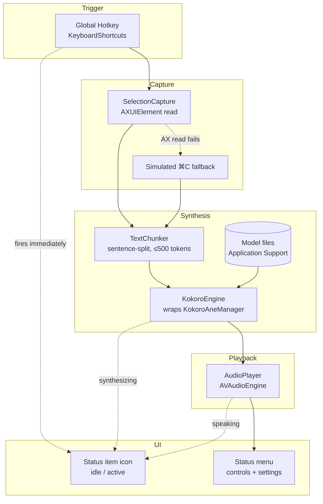

# Aloud — Implementation Spec

Select text anywhere on macOS, press a hotkey, hear it read aloud in a natural
voice. Local-only, no cloud calls, no Python.

## 1. Core user flow

1. User selects text in any app (Safari, Mail, Notes, Slack, a PDF, …).
2. User presses a global hotkey (default `⌃⌥Space`, user-customizable).
3. Aloud reads the current text selection via the macOS Accessibility API,
   chunks it into sentence-sized pieces, and starts synthesizing + playing
   audio within roughly a second.
4. The menu bar icon itself changes the instant the hotkey fires — before
   any audio starts — so it's always obvious whether Aloud is idle or doing
   something.
5. Clicking the icon opens a standard menu with play/pause/stop, voice,
   speed, hotkey and launch-at-login. There is no main window.

## 2. Tech stack

| Concern | Choice |
|---|---|
| UI | SwiftUI (macOS 15+), AppKit `NSStatusItem` for the menu bar item |
| TTS engine | [`FluidInference/FluidAudio`](https://github.com/FluidInference/FluidAudio) `KokoroAneManager`: Kokoro-82M converted to CoreML, runs fully on-device. Apache-licensed model and Swift package. |
| G2P (text→phonemes) | FluidAudio's English frontend (Misaki US lexicon + CoreML G2P fallback). US English only. |
| ML runtime | CoreML: 4 stages on the Neural Engine, 3 on CPU/GPU |
| Global hotkey | [`sindresorhus/KeyboardShortcuts`](https://github.com/sindresorhus/KeyboardShortcuts) — MIT, 2.7k★, actively maintained, gives us the recorder UI for free |
| Text selection capture | Accessibility API (`AXUIElement`), with simulated-copy as a silent fallback (see §5.2) |
| Audio playback | `AVAudioEngine` + `AVAudioPlayerNode`, streaming buffers per chunk |
| Model distribution | Bundled in the app (~100 MB), fetched at build time from a pinned Hugging Face commit and checksum-verified |

**Platform floor:** macOS 15.0+, Apple Silicon only (Neural Engine) — confirmed
acceptable. This machine (macOS 26.6, arm64) satisfies it.

## 3. Engine choice

**Current (October 2026): FluidAudio.** v0.1.x used `mlalma/kokoro-ios` on
MLX (below). It was replaced because kokoro-ios had no commits after
January 2026, and FluidAudio runs the same Kokoro-82M weights faster and
with much less memory. Measured on an M2 for the same 420-character
paragraph:

| | kokoro-ios (MLX) | FluidAudio (CoreML) |
|---|---|---|
| Warm hotkey-to-first-audio | ~700 ms | ~280 ms |
| Peak memory footprint | 8.6 GB | 0.73 GB |
| Model download | ~340 MB | ~130 MB |

Costs of the switch: no per-word timestamps (word highlighting was
dropped), US pronunciation only (the UK voices were dropped), and the
download comes from Hugging Face instead of a pinned GitHub commit.

**Original choice (August 2026):** checked three "native Swift, no Python"
options:

| Repo | Verdict |
|---|---|
| `mweinbach/kokoro-swift` | ❌ Single commit, created and abandoned within 13 minutes, 6★ — too unproven to build on despite a nicer on-demand-voice-download API. |
| `mattmireles/kokoro-swift-mlx` | ❌ Explicitly "experimental," requires manually compiling `espeak-ng` into an `.xcframework`, phonemizer differs from upstream Kokoro (audible quality drift). |
| **`mlalma/kokoro-ios`** | ✅ 30 commits over a year, 277★, actively maintained (last push Jan 2026), MIT license, merged PRs, no espeak needed (Misaki G2P bundled), has a working reference app (`KokoroTestApp`) we can crib real integration code from. |

## 4. Architecture


```mermaid
flowchart TB
    subgraph Trigger
        HK[Global Hotkey<br/>KeyboardShortcuts]
    end
    subgraph Capture
        SEL[SelectionCapture<br/>AXUIElement read]
        FALLBACK[Simulated ⌘C fallback]
    end
    subgraph Synthesis
        CHUNK[TextChunker<br/>sentence-split, ≤500 tokens]
        ENGINE[KokoroEngine<br/>wraps KokoroAneManager]
        MODEL[(Model files<br/>Application Support)]
    end
    subgraph Playback
        PLAYER[AudioPlayer<br/>AVAudioEngine]
    end
    subgraph UI
        ICON[Status item icon<br/>idle / active]
        MENUBAR[Status menu<br/>controls + settings]
    end

    HK --> SEL
    HK -. fires immediately .-> ICON
    SEL -. AX read fails .-> FALLBACK
    SEL --> CHUNK
    FALLBACK --> CHUNK
    CHUNK --> ENGINE
    MODEL --> ENGINE
    ENGINE --> PLAYER
    ENGINE -. synthesizing .-> ICON
    PLAYER -. speaking .-> ICON
    PLAYER --> MENUBAR
```

## 5. Component details

### 5.1 HotkeyManager
Thin wrapper around `KeyboardShortcuts`. Registers one shortcut,
`.readSelection`, default `⌃⌥Space`. Fires an `AsyncStream`/callback that the
app coordinator listens on. Rebinding happens through `KeyboardShortcuts.Recorder`
dropped straight into the Settings UI — no custom Carbon code needed.

### 5.2 SelectionCapture
Primary path (per your choice): read the selection directly via Accessibility,
no clipboard involved.

```
1. AXUIElementCreateSystemWide()
2. AXUIElementCopyAttributeValue(..., kAXFocusedUIElementAttribute, ...)
3. AXUIElementCopyAttributeValue(focusedElement, kAXSelectedTextAttribute, ...)
```

Caveat to design around: **not every app exposes `kAXSelectedTextAttribute`**
(some Electron/Chromium-embedded views and custom-drawn text views don't).
When the AX read returns empty/nil, Aloud falls back — invisibly to the user —
to a simulated `⌘C` (CGEvent) + pasteboard read, restoring whatever was on
the clipboard before. This keeps the "no clipboard flicker" behavior as the
common case while not silently failing in apps that don't support AX text
selection.

Requires the **Accessibility** permission (System Settings → Privacy &
Security → Accessibility). Requested via `AXIsProcessTrustedWithOptions`
during onboarding.

### 5.3 TextChunker
Kokoro caps input at **510 phoneme tokens** per call
(`KokoroAneConstants.maxPhonemeLength`), which in practice is roughly 1–2
sentences of English. Arbitrary selected text (a paragraph, an article) must
be split before synthesis:

- Split on sentence boundaries (`NLTokenizer` sentence unit) first.
- If a single sentence still risks exceeding the token cap, sub-split on
  clause punctuation (`,`, `;`, `—`) as a fallback.
- A first sentence longer than 80 characters is split at its first clause
  break (between characters 20 and 160), because playback can't start until
  the first chunk has fully synthesized.
- Short sentences after the first chunk are merged up to 250 characters, to
  save per-call overhead.
- Each chunk is synthesized independently and played back-to-back.

FluidAudio also splits over-long phoneme input itself, so a chunk over the
cap is no longer skipped.

### 5.4 KokoroEngine
Wraps FluidAudio's `KokoroAneManager`:

```swift
let manager = KokoroAneManager()
try await manager.initialize(preloadVoices: Set(Voices.all.map(\.id)))
let samples = try await manager.synthesizeDetailed(text: chunkText, voice: voiceName, speed: speed).samples
```

- `samples`: `[Float]` mono PCM @ 24kHz.
- All voices are preloaded at load time, so changing voice later works
  offline.
- The model loads at launch, followed by one short warm-up synthesis, so the
  first real read is not the slow one.
- To keep latency low on long selections, chunks are synthesized **serially
  but pipelined**: chunk *N+1* synthesis starts as soon as chunk *N* is
  handed to the player, so playback doesn't wait for the whole selection to
  finish generating.

### 5.5 ModelManager
The model (~100 MB) is **bundled in the app** as `Resources/Model`, so the
app never downloads anything:

- **Build time:** `scripts/fetch-model.py` runs as a pre-build step. It
  downloads each file listed in `scripts/model-files.tsv` from a fixed
  commit of `FluidInference/kokoro-82m-coreml` on Hugging Face into the
  git-ignored `Model/` folder, and fails the build if a SHA-256 differs.
  English voices other than `af_heart` exist only as `voices/<name>.json`;
  the script converts them to FluidAudio's flat fp32 `.bin` layout,
  byte-exact with `KokoroAneVoicePack.load(fromJSON:)`. Only files English
  synthesis reads are included (no Spanish, French or UK lexicons).
  `fetch-model.py --repin <commit>` moves the list to a new commit, checking
  each download against the Hugging Face tree first.
- **Launch:** FluidAudio only reads models from `~/.cache/fluidaudio/Models/`.
  `ModelManager` checks each cached file against `files.tsv` (~0.3 s, off the
  main actor), copies any missing or changed file from the bundle (a clone on
  APFS), and only then loads the engine. Reads are refused until this is done.
- `ModelRegistry.baseURL` is set to an unresolvable host, so if FluidAudio
  ever tried to download a missing file, it would fail instead of going
  online.
- The first load after install takes ~10 s while CoreML compiles the model
  for the Neural Engine; later launches take ~1 s. Onboarding shows
  "Preparing voices…" until it is ready.
- After a successful install, the MLX files from v0.1.x in
  `~/Library/Application Support/Aloud/Models/` are deleted.

### 5.6 AudioPlayer
`AVAudioEngine` + single `AVAudioPlayerNode`. Chunks are scheduled as they
finish synthesizing (`scheduleBuffer`), giving continuous playback across
chunk boundaries. Exposes play/pause/stop to the UI. When a read finishes,
the player node and engine stop, so the output device does not stay awake.

### 5.7 Status item — idle vs. active
No dock icon; `NSStatusItem` is the app's only permanent presence, and it is
also the primary "is it doing something?" signal, since there's no window to
glance at otherwise. Two visual states, both template (monochrome, tints
correctly in light/dark menu bars):

| State | Trigger | Look |
|---|---|---|
| **Idle** | Default; also resumes the instant playback finishes/stops | Static outline waveform glyph |
| **Active** | Set the instant the hotkey fires (before capture/synthesis even completes) and held through synthesis + playback | Filled waveform glyph, bars gently pulsing (looping `NSImageView` frame animation or a `CADisplayLink`-driven redraw, ~4 frames, respects Reduce Motion by freezing on a single filled frame instead of animating) |

The state flips to Active *before* the AX read or first chunk of audio is
ready — a hotkey press always gets instant feedback, even during the ~1s
gap before sound starts. This is the main reason the icon-state signal
exists: without it, a press that silently takes a second to produce sound is
indistinguishable from a press that did nothing.

### 5.8 Status menu
`NSStatusItem` click → a standard `NSMenu`, rebuilt on every open
(`menuNeedsUpdate`) so it always shows the current state:

- An error line, if the last hotkey press failed (the press also beeps,
  because no window opens).
- Model status, while the model is downloading or if it failed (with
  Retry).
- Pause / Resume / Replay Last Selection, and Stop.
- Voice submenu: 20 US voices grouped by gender. Choosing one sets it as the
  default and plays a short sample.
- Speed submenu: 0.5× to 2.0× in 0.1 steps.
- Change Hotkey (shows the current one): opens a small dialog with
  `KeyboardShortcuts.RecorderCocoa`. The recorder can't take keyboard focus
  when it's hosted inside the menu itself.
- Launch at Login, Grant Accessibility Access (only when missing), Quit.

The icon animation timer runs in the common run loop modes, so it keeps
animating while the menu is open.

### 5.9 Onboarding (first launch only)
Not an ongoing UI surface — a small transient window shown once before the
menu bar item is fully functional, then never shown again (reachable later
only by resetting the app). Two steps:
1. Explain what Aloud does and request Accessibility permission, with a
   deep link to the System Settings pane.
2. Once the voices are prepared, play a sample sentence to
   confirm the whole pipeline works end-to-end.

After this window closes, everything else happens through the status item.

## 6. Project structure

```
Aloud/
  Package.swift                 # or Aloud.xcodeproj generated via xcodegen
  Sources/Aloud/
    App/
      AloudApp.swift
      AppCoordinator.swift       # wires hotkey -> capture -> chunk -> engine -> player
    Capture/
      SelectionCapture.swift
    Synthesis/
      TextChunker.swift
      KokoroEngine.swift
      ModelManager.swift
    Playback/
      AudioPlayer.swift
    UI/
      MenuBar/
        StatusItemController.swift  # icon animation + status menu
        StatusIconRenderer.swift
      Onboarding/                   # one-time window only
    Support/
      PermissionsManager.swift
      SettingsStore.swift        # @AppStorage-backed
  Resources/
    (icons, no model files)
```

## 7. Build & signing note

Ad-hoc/unsigned rebuilds reset TCC (Accessibility) grants on every build,
which gets annoying during development. Recommend signing with a stable
identity (free Apple ID personal team is enough) so the Accessibility grant
survives rebuilds.

**Releases:** `.github/workflows/build.yml` builds the app and a `.dmg` on
every push and pull request. To release, set `MARKETING_VERSION` in
`project.yml`, add `.github/release-notes/vX.Y.Z.md`, then push the tag
`vX.Y.Z`. CI checks that the tag matches the app version and creates the
GitHub release with the DMG and those notes.

## 8. MVP scope

**In scope (v1):**
- Global hotkey → AX selection capture → chunked Kokoro synthesis → streaming
  playback.
- Status item with idle/active icon states.
- Status menu: playback controls, voice, speed, hotkey, launch-at-login,
  permission/model status. No main window.
- First-run onboarding (permission + model download), one-time only.

**Phase 2 (not in v1):**
- Playback history / re-read past selections.
- Per-app hotkey behavior or exclusions.
- UK English voices, once FluidAudio's English frontend has a British
  lexicon.
- More languages (FluidAudio has Spanish, French, Mandarin and Japanese
  variants).

## 9. Open risks

- **Build-time model source**: building from source needs the pinned commit
  of `FluidInference/kokoro-82m-coreml` to stay on Hugging Face. Released
  builds are unaffected (the model is inside them). If the repo is removed,
  the files would need a mirror, e.g. this repo's release assets.
- **FluidAudio upgrades**: a new FluidAudio version can rename model files
  (as with the `_v2` stages) or change what it reads. Update the paths in
  `scripts/model-files.tsv`, re-pin, and test offline from an empty cache.
- **AX selection gaps**: apps that don't expose `kAXSelectedTextAttribute`
  need the copy-fallback path exercised and tested (Slack, VS Code/Electron
  apps, some PDF viewers are the likely trouble spots).
- **OS-specific CoreML bugs**: FluidAudio warns about BNNS crashes on some
  OS releases (it reports macOS 26.6 as fixed). Watch for synthesis crashes
  after OS updates.
- **Menu bar icon animation cost**: an animated status item needs a repeating
  timer/redraw while active; keep the frame count and redraw rate low (macOS
  menu bar extras are not supposed to be a CPU/battery drain) and stop the
  timer the instant playback ends rather than after a delay.
